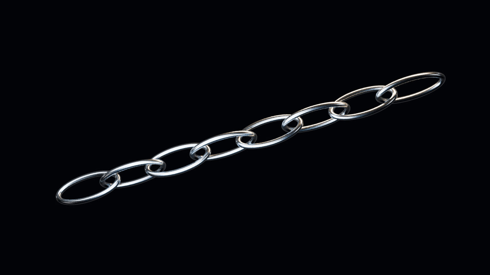
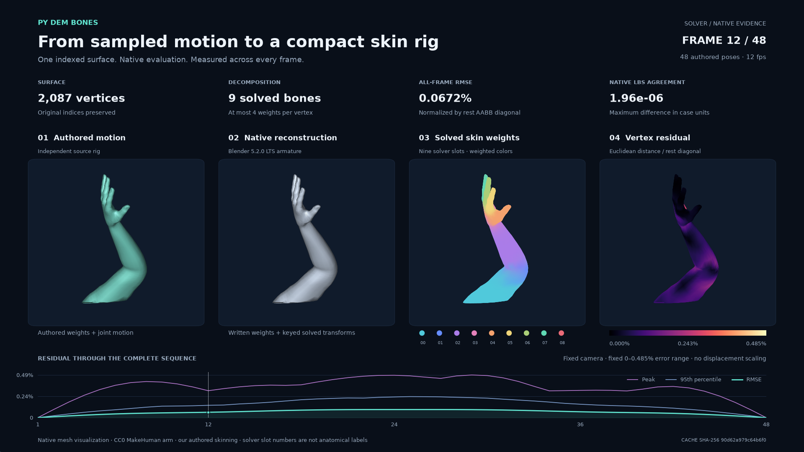

# py-dem-bones

[English](README.md) | [中文](README_zh.md)

Python bindings and a host-independent NumPy interface for [Dem Bones](https://github.com/electronicarts/dem-bones), which approximates a mesh animation with sparse linear blend skinning weights and rigid bone transforms. The method follows [Smooth Skinning Decomposition with Rigid Bones](https://graphics.cs.uh.edu/ble/papers/2012sa-ssdr/index.html) by Binh Le and Zhigang Deng. The native solver is the upstream Dem Bones library; this project provides bindings and data contracts for DCC pipelines.

## Install

```bash
pip install py-dem-bones
```

For a source build, install a C++ compiler, clone with submodules, then run `pip install -e .`. Supported package metadata declares Python 3.8+; wheel availability depends on the published build matrix.

## Solve a mesh sequence

```python
import numpy as np
from py_dem_bones import solve_skinning

rest = np.array([[0., 0., 0.], [1., 0., 0.], [0., 1., 0.], [0., 0., 1.]])
poses = np.stack([rest, rest + np.array([0., 0., 0.2])])
result = solve_skinning(rest, poses, bone_count=1)
print(result.weights.shape)     # (actual_bones, 4)
print(result.transforms.shape)  # (2, actual_bones, 4, 4)
```

The input contract is `rest=(vertices, 3)` and `poses=(frames, vertices, 3)`, with at least three vertices. Every frame must have the same vertex count, vertex order, units, and coordinate space. Multi-bone solves require `faces`, a sequence of polygons containing zero-based vertex indices, so the native solver can initialize connected bone regions. See the [two-bone example](examples/portable_example.py). The solver can produce fewer than the requested bones. Results contain weights `(bones, vertices)` and **all** transforms `(frames, bones, 4, 4)`. [DCC integration guide](docs/dcc_integration.rst) explains axis conversion and the native matrix layout.

## DCC support

The portable API has no host SDK dependency. Packaged adapters under `py_dem_bones.adapters` provide Maya and Blender mesh sampling/weight writing, Houdini weight attributes, a 3ds Max Skin integration, and an explicit Unreal sampler/writer bridge. SDK imports are lazy. See the [DCC integration guide](docs/dcc_integration.rst) for each adapter's requirements and limits, and [`examples/`](examples/) for usage. The [Maya standalone smoke test](tests/integration/maya_skinning_smoke.py) provides repeatable host acceptance; [DCC-MCP deformation cases](tests/integration/maya_deformation_cases.py) verify multi-joint animation, transformed rigs, and non-rigid residuals inside Maya. Writing weights does not bake the solved bone animation; bind poses and hierarchy need explicit host handling.

The [architecture decision](docs/adr/0002-host-adapters-and-native-kernel.md) describes the shared adapter lifecycle, solver ownership, and host writeback contracts.

## Native DCC showcase

### Octopus: softbody motion to skinning


Native Houdini Vellum creates compliant arm motion with inertia and ground
contact. Dem Bones fits **81 rigid bones** to 48 source poses on a fixed
8,000-point proxy, with **0.04102% normalized RMSE**. Native Point Deform
transfers the result to the 29,542-point artist body while preserving topology
and three UV sets. All 48 frames pass native readback and fresh scene reopening.
Source arm-tip excursions are 27–39 cm; reconstruction retains 96.46–100.22% of their
tip excursions. [Exact native evidence](docs/showcase/arm-skin/octopus-softbody-native-report.json).


[Four-second MP4](docs/showcase/arm-skin/octopus-mantra-motion.mp4) ·
[Native animation receipt](docs/showcase/arm-skin/octopus-native-animation.json)


The scientific comparison uses the accepted proxy buffers, a fixed error scale
and unmodified source samples. Presentation subdivision is excluded from solver
metrics. The physical source uses stretch/bend and internal struts; it is an
open-surface softbody study.

### Octopus materials


[Editable Substance Designer graphs and SBSAR](examples/showcase/materials/octopus/)
produce 18 native 2K maps across body, sucker and mapped-material studies.
The stylized eight-arm [Kraken sculpt](examples/showcase/assets/octopus/SOURCE.json)
by FIELDFLY3R (fld) is licensed under **CC BY 4.0**. The original rest-pose
closeup combines native Mantra SSS with HDRI lighting; its
[matched SSS off/on study](docs/showcase/arm-skin/README.md) uses identical
geometry, camera and lights. Original asset and texture bytes are preserved.

A separate [authored motion baseline](docs/showcase/arm-skin/octopus-native-report.json)
uses 33 controls and 48 prescribed poses, with **0.01813% normalized RMSE**.
This kinematic baseline has its own native readback and scene-reopening records.

### Skin and steel


Our own skin weights on a free CC0 arm with nine bones, 48 native poses and
approximately **0.067% normalized RMSE** in Maya, Blender, Houdini and UE5.8.
Designer skin maps, shader-authored pores, real HDRI lighting and native SSS
drive the closeup. The gallery includes matched SSS off/on renders, steel
reflections, Unreal hand detail, and native animation from all four hosts.





[Gallery, videos and exact acceptance status](docs/showcase/arm-skin/README.md)
separates native beauty renders from numerical visualization. Presentation
smoothing is excluded from solver metrics. Updated Maya look development
still awaits native acceptance.
[Reproduce through DCC-MCP](examples/showcase/README.md).

## Develop and release

```bash
git clone --recurse-submodules https://github.com/loonghao/py-dem-bones.git
cd py-dem-bones
pip install -e ".[test]"
pytest
```

Conventional commits merged to `main` feed release-please. It opens a release PR that updates the version, changelog, and citation metadata; merging that PR creates the `vX.Y.Z` tag and GitHub Release. The tag triggers wheel and source builds and PyPI publication after the build jobs succeed. See [release workflow documentation](docs/ci_cd.rst).

## Documentation and license

For the Windows CRT/OpenMP policy and optional msvc-kit wheel build, see the
[Windows toolchain contract](docs/windows-toolchain.md).

[Documentation](https://loonghao.github.io/py-dem-bones/) · [Contributing](CONTRIBUTING.md) · [Changelog](CHANGELOG.md) · [BSD 3-Clause license](LICENSE.md) · [Third-party licenses](3RDPARTYLICENSES.md)
