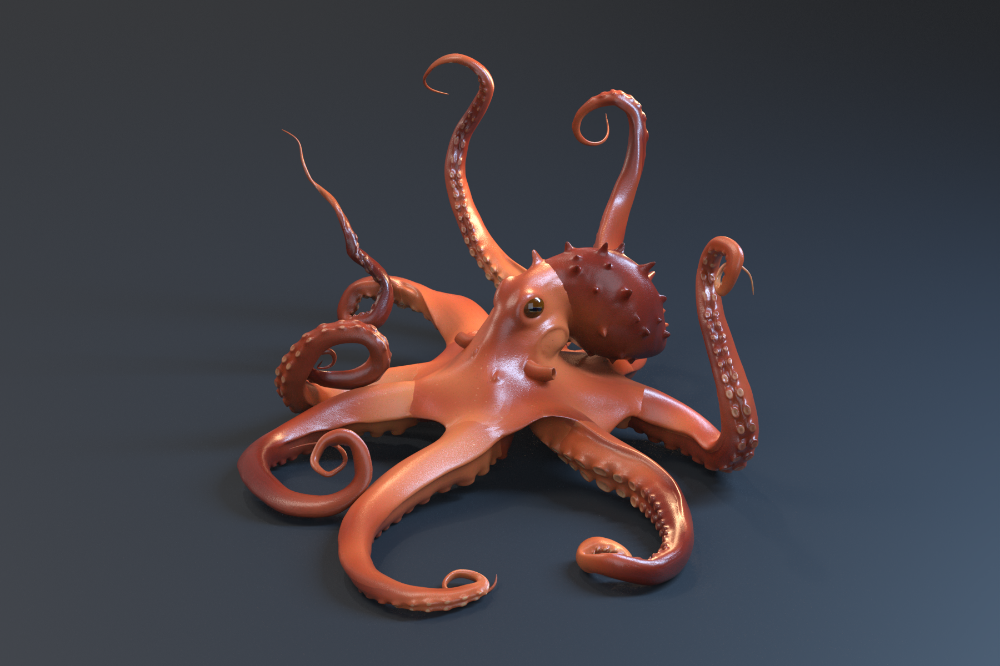
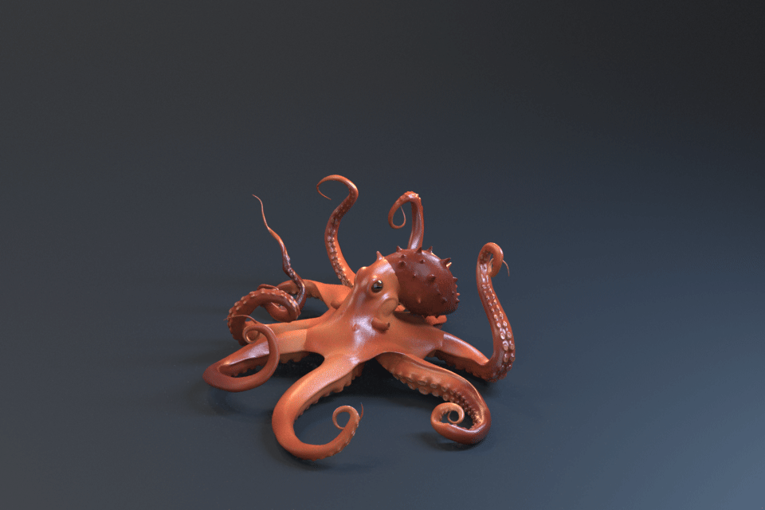
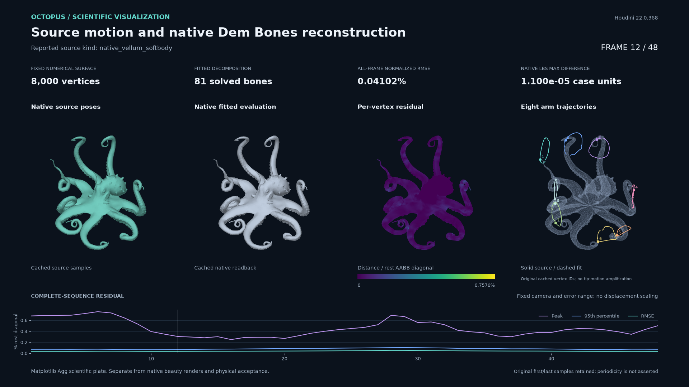
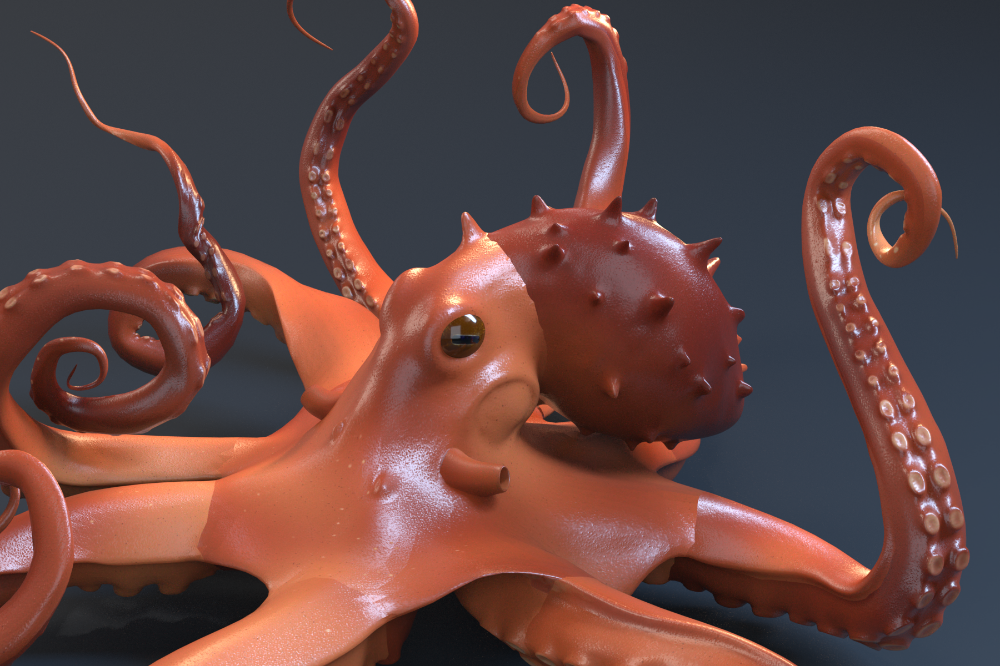
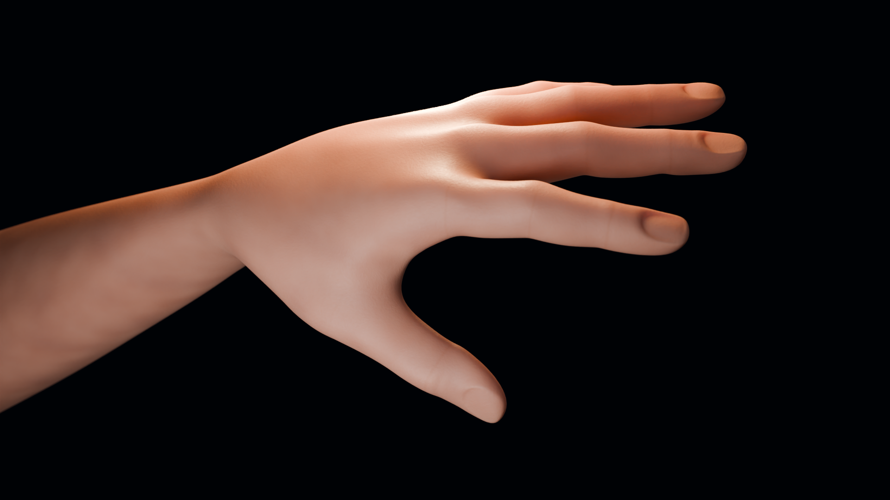

Native render studies
=====================

The octopus study uses Houdini. The arm and rigid-chain cases exercise the shared
skinning contracts through DCC-MCP in Maya, Blender, Houdini and Unreal Engine 5.8.

Octopus: Vellum motion to skinning
----------------------------------------

Houdini 22.0.368 Vellum supplies the dynamic source: stretch/bend constraints,
internal struts, 96 compliant arm-tip targets, and native self/ground collision.
The study samples 48 poses at 12 fps after warmup. The eight source arm tips
have peak-to-peak excursions of 27–39 cm and lag their drivers by 83–167 ms.

Dem Bones fits **81 rigid bones** on a fixed 8,000-point, 15,936-triangle proxy,
with **0.04102% normalized RMSE** across all 48 frames. The fitted tip excursions
retain 96.46–100.22% of the source range; maximum tip reconstruction error is
17.42 mm. RMSE is the root mean square Euclidean vertex distance, normalized
by the rest-pose AABB diagonal. These measurements apply to the numerical proxy.

Native Houdini Point Deform transfers the result to the 29,542-point,
58,912-triangle artist body. All 48 frames retain the original topology and
three UV sets. Maximum ground penetration is 0.945 mm for the fitted proxy and
0.259 mm for the artist transfer. A separate saved-scene reopening verifies all
48 source, numerical and artist buffers, with zero differences from accepted
readback. The :download:`source report <showcase/arm-skin/octopus-softbody-native-source.json>`,
:download:`fit report <showcase/arm-skin/octopus-softbody-native-report.json>`,
:download:`native readback <showcase/arm-skin/octopus-softbody-native-readback.json>`
and :download:`fresh reopen <showcase/arm-skin/octopus-softbody-native-reopen.json>`
record separate acceptance checks.

The :download:`four-second animation <showcase/arm-skin/octopus-mantra-motion.mp4>`
contains all 48 native Mantra frames. Source endpoints remain unchanged;
neither motion amplification nor endpoint matching is applied. This is an
open-surface softbody study: the proxy has 60 boundary edges, so closed pressure
and volume conservation are outside its acceptance contract.

The :download:`native hero receipt <showcase/arm-skin/octopus-native-hero.json>`
and :download:`native animation receipt <showcase/arm-skin/octopus-native-animation.json>`
record each render's verification and output hashes.

The scientific plate uses accepted cached source and native evaluation buffers.
It displays a fixed full-sequence camera, linear residual range and original
arm landmark trajectories. Its :download:`scientific receipt <showcase/arm-skin/octopus-scientific-evidence.json>`
records accepted input hashes and recomputed metrics. Matplotlib rendering is
separate from native beauty renders. Presentation subdivision and coordinate
transforms are excluded from numerical acceptance.

Octopus materials
-----------------

The `Kraken sculpt by FIELDFLY3R (fld)
<https://sketchfab.com/3d-models/kraken-ca7e400c9cb34e02a6dfd74aecf26eff>`_
is licensed under `CC BY 4.0 <https://creativecommons.org/licenses/by/4.0/>`_.
The source is a static sculpt. The native Mantra material closeup uses real
HDRI lighting and subsurface scattering. A matched SSS off/on pair preserves
geometry, camera and lights; it measures a material change, separately from
motion reconstruction. The :download:`material render receipt <showcase/arm-skin/octopus-material-render.json>`
records native job verification and the pixel comparison.

The `Substance Designer source and compiled SBSAR
<https://github.com/loonghao/py-dem-bones/tree/8a7664d1c6e7dbe0f70a58258486274e15bda96b/examples/showcase/materials/octopus>`_
deliver 18 native 2K maps across body, sucker and mapped-material studies.
The distributed original GLB and extracted BaseColor remain byte-for-byte
unchanged. The showcase selects the complete octopus body and excludes the
separate ray and four decorations; :download:`asset provenance <../examples/showcase/assets/octopus/SOURCE.json>`
records the license, byte hashes and source mesh selection. Render subdivision
and presentation transforms are excluded from numerical acceptance.

The separate authored-motion baseline generates 48 poses from eight arm paths
and 33 controls. Dem Bones fits a fixed 8,000-point numerical proxy with
**0.01813% normalized RMSE**. Native Houdini Point Deform transfers the solved
motion to the 29,542-point artist body, retaining all 58,912 triangles and three
UV sets. Fresh native scene reopening verifies all 48 frames. This baseline is
kinematic; it does not assert softbody simulation.

Skin and steel
--------------

The 1920 × 1080 Cycles closeup combines unchanged Designer texture exports
with shader-authored complexion, pores and crease detail, a real CC0 HDRI,
and rectangular softboxes. Its SSS pair changes only scattering weight under
identical camera and lighting. The steel-chain study adds native strip-light
reflections and a complete 48-frame animation. Saved Blender scenes are
reopened to check packed textures, HDRI and the original rig coordinates.

Presentation subdivision affects only rendered surfaces and is excluded from
numerical acceptance. Cameras and lights may track actual pose bounds;
the accepted rig, pose sequence and timing remain unchanged. Procedural skin
detail is artist-authored, not scanned anatomy. Rigid-chain motion is prescribed,
not a collision simulation.

The solver evidence plate and video use Matplotlib Agg to display the accepted
Blender cache: source motion, reconstruction, solved weight colors and a fixed
vertex-error scale. They are scientific visualizations, separate from native
beauty renders and fresh host acceptance.

Unreal's HDRI/Subsurface captures use an independent Loop render proxy after
native DynamicMesh weight/pose readback. They are real-time SDK previews,
not path-traced skin or SkeletalMesh animation exports. Houdini's completed
arm sequence uses Mantra and an explicit Python SOP deformer; new motion-study
completion is recorded individually in the gallery. Renderer scales and display
transforms differ, so cross-host images are not a calibrated skin comparison.
Updated Maya look development remains unverified; Arnold media retains the
first material iteration.

See the :doc:`rendered gallery and validation ledger <showcase/arm-skin/README>`
for exact host results and remaining work, and the `DCC-MCP example guide
<https://github.com/loonghao/py-dem-bones/tree/main/examples/showcase>`_
for native entry points. The gallery distinguishes native rig evaluation
from the explicit Houdini deformers and Unreal DynamicMesh example bridges.

.. toctree::
   :hidden:

   showcase/arm-skin/README
