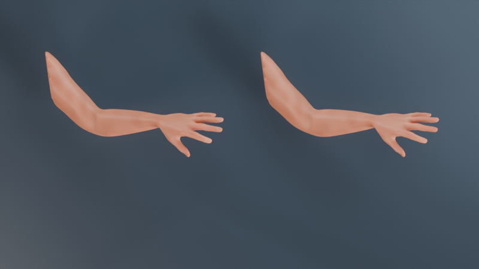
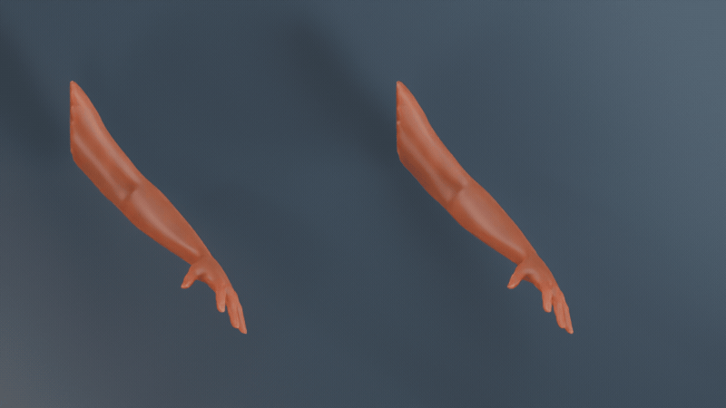
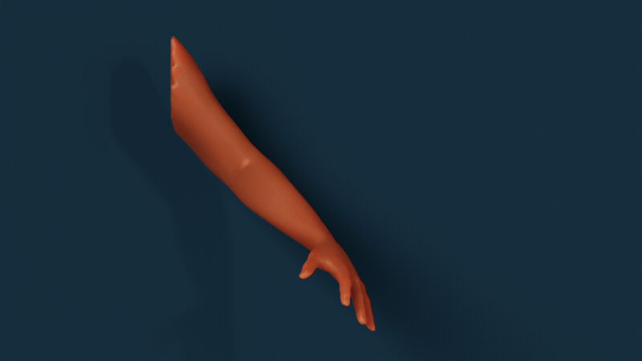
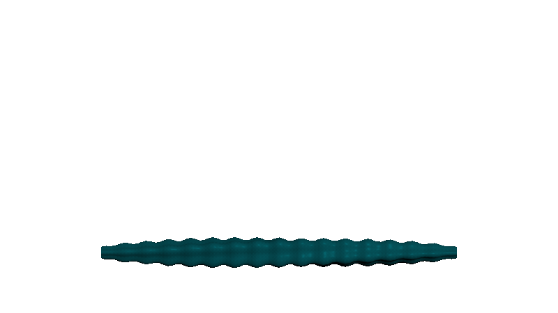
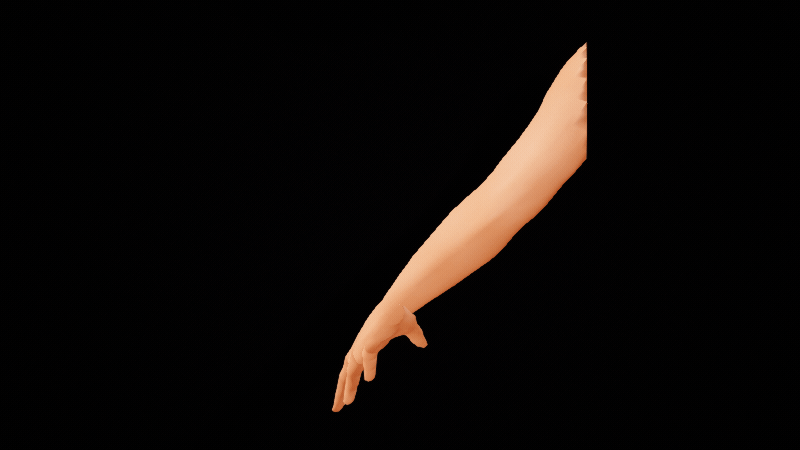
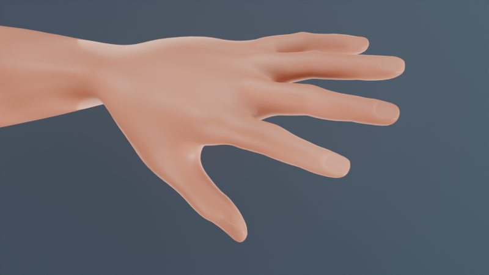
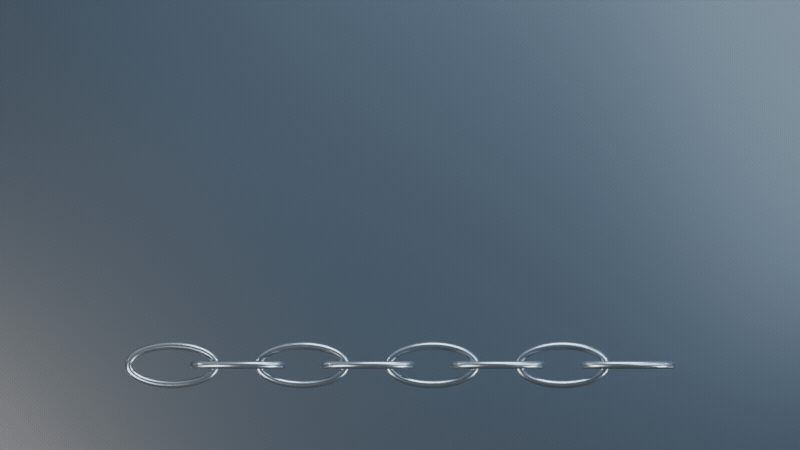
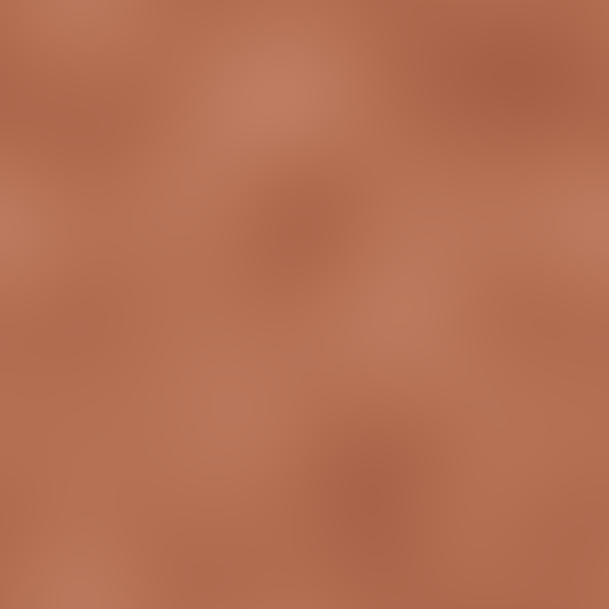
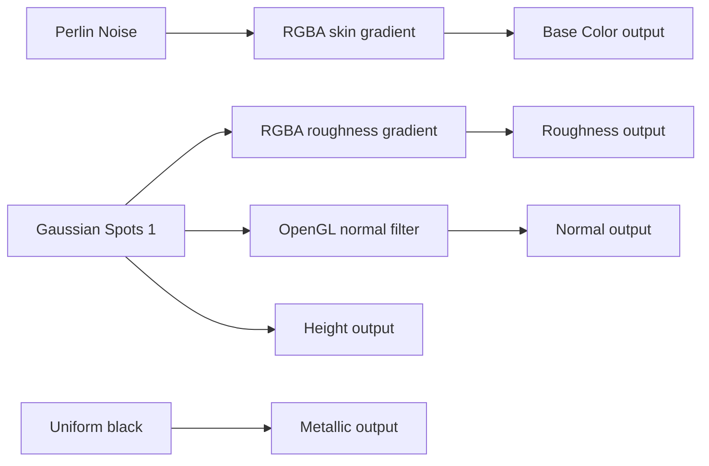
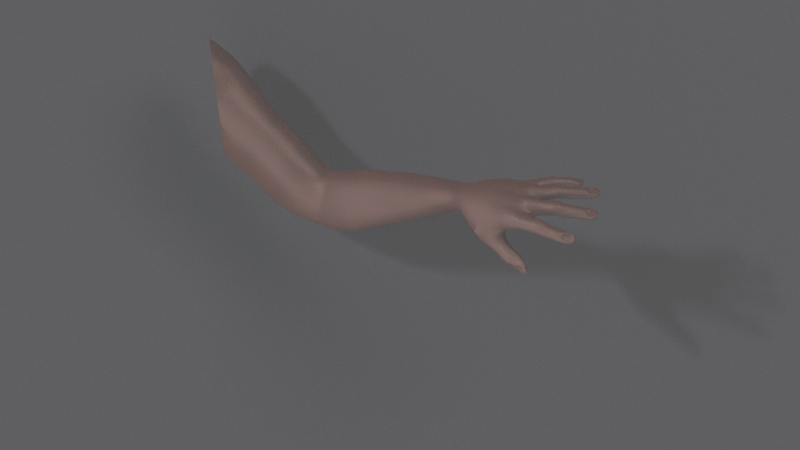

# Arm skinning: Designer materials and native DCC previews

The left arm uses our authored weights; the right arm uses Dem Bones weights
and solved joint animation. This is a native Blender Cycles render. The free
[MakeHuman arm](../../../examples/showcase/assets/arm.obj) has 2,087 vertices
and 2,068 polygons. We author nine influences and 48 poses, then validate the
reconstructed animation in Maya, Blender, Houdini and Unreal Engine 5.8.

**Look development is in progress.** Blender's complete sequence uses the
lighter Designer palette and SSS scale `0.03`. Its packed scene was reopened
through DCC-MCP; the bound textures and HDRI match the published asset hashes.
Maya retains the first palette and scale `0.09`. The updated Maya material,
complete Houdini Mantra arm sequence and Unreal SSS sequence await native
acceptance. See [validation](validation.json) and
[file hashes](manifest.json) for the exact completed evidence.

## Native animation gallery

| Blender 5.2 — Cycles, HDRI + SSS | Maya 2026 — Arnold, HDRI + SSS first pass |
| --- | --- |
|  |  |

| Houdini 22.0 — OpenGL tentacle preview | Unreal 5.8 — lit DynamicMesh arm preview |
| --- | --- |
|  |  |

All GIFs contain 48 native frames at 800 × 450, approximately four seconds at
12 fps. Encoding uses a 128-color palette; no generated imagery, retiming,
synthetic in-between frames or geometry correction is applied. Houdini's
OpenGL clip and Unreal's lit clip are deformation previews. They do not
demonstrate the final HDRI skin material.

### Native SSS comparison

| SSS off | SSS on, weight 0.65 and scale 0.03 |
| --- | --- |
|  |  |

Both native Cycles renders use frame 12, the same camera, HDRI, backlight,
skin maps and 128 samples. Only the subsurface weight changes. This is an
artistic comparison, not a measurement of real skin scattering coefficients.
The [packed texture readback](blender-packed-readback.json) records the
native reopened material's bound bytes, relative paths and SSS settings.

### Rigid metal chain

Eight alternating links contain 2,560 vertices and 2,560 polygons. Each source
link has one rigid influence. The solved Blender animation has maximum
relative edge stretch `0.002655%`, below the `0.1%` acceptance limit. The native
Maya and Houdini caches also pass this limit. Unreal chain acceptance remains
pending. This is prescribed rigid motion, not a collision or dynamics test.

The chain and tentacle illustrate rigid and smoothly blended motion inspired
by [SSDR](https://binh.graphics/papers/2012sa-ssdr/). They are our procedural
fixtures; these results are not measurements on the paper's original datasets.

## Source mesh and our own skin weights

[MakeHuman core graphical assets are CC0](https://static.makehumancommunity.org/about/license.html).
The source is pinned to commit `a8bc2d54ff0ac92e78ff71431b1023eda42bf482`.
We clip the body to an arm, weld boundary intersections and close the shoulder.
The original rig, skin weights and skin textures are excluded.
[Provenance and hashes](../../../examples/showcase/assets/SOURCE.json) record
the exact source and modifications.

Our weight authoring uses shoulder, elbow, wrist, palm and five finger bases.
An anatomical capsule falloff keeps at most four influences per vertex,
then normalizes their sum. This is scripted weight authoring rather than a
claim of interactive brush painting. Maya's source skinCluster is written,
read back and sampled for every pose. Blender independently evaluates a
native source rig for the side-by-side presentation.

The solver receives ordered mesh poses and polygon connectivity. A hard
nearest-center seed initializes nine regions; source joint transforms are
not supplied to the solver. The animation is an approximation of those
authored poses, rather than a scan of biological tissue or a captured actor.

## Numerical validation

| Host | Native evaluation | Arm normalized RMSE |
| --- | --- | ---: |
| Maya 2026 | skinCluster and keyed solved joints | 0.0672013% |
| Blender 5.2.0 LTS | armature and evaluated mesh | 0.0672015% |
| Houdini 22.0.368 | scalar weights and case-owned Python SOP LBS | 0.0672012% |
| Unreal 5.8.0 | DynamicMesh bone profile and case-owned SDK LBS | 0.0670133% |

Normalized RMSE is the root mean square Euclidean vertex error divided by the
rest mesh bounding-box diagonal. Every host verifies all 48 frames, finite
nonnegative weights, normalized weight sums, rigid rotations, and native
evaluation against the solved linear blend skinning result. The cached
native arrays were revalidated on 2026-09-30; this is separate from a fresh
live-host run. The UE difference includes native bone-weight quantization.

Houdini uses the package's scalar weight attributes plus an explicit example
deformer, not a production boneCapture rig. Unreal uses a version-owned
DynamicMesh bridge, not a SkeletalMesh or animation asset exporter.
Render-only smoothing in Maya and Blender is excluded from numerical checks.

MakeHuman uses [decimeters internally](https://static.makehumancommunity.org/makehuman/docs/exports_and_file_formats.html).
Maya, Blender and Houdini retain the asset's numeric coordinates in this case.
The current Unreal preview multiplies samples by `100`, so it is ten times
the physical arm size in centimeters. Raw distance errors and scattering
scales are therefore not physically comparable across hosts. The normalized
metric remains independent of a uniform preview scale.

## Material authored in Substance 3D Designer

[Editable SBS](../../../examples/showcase/materials/skin/material.sbs) ·
[Native SBSAR export](../../../examples/showcase/materials/skin/material.sbsar) ·
[First preview palette](../../../examples/showcase/materials/skin/preview-v1/BaseColor.png)

Designer 16.0.0's native graph uses Perlin Noise for broad color variation
and Gaussian Spots 1 for pores. RGBA gradient keys establish the skin palette
and roughness; pores feed Height and an OpenGL normal filter at intensity
`0.025`. Metallic is zero. The native DCC-MCP export job completed and the
SBSAR archive passes its container integrity check. Reopening and recomputing
the saved packages still needs verification.

This diagram reflects the saved graph connections. A complete unretouched
DCC-CUA graph capture is still pending. The SBS references the installed
Adobe standard library using `sbs://`; library source files are not included.

| Exported map | Resolution | Native PNG | Interpretation |
| --- | --- | --- | --- |
| [Base Color](../../../examples/showcase/materials/skin/BaseColor.png) | 1024² | RGBA16 | sRGB |
| [Roughness](../../../examples/showcase/materials/skin/Roughness.png) | 1024² | RGBA16 | linear data |
| [Metallic](../../../examples/showcase/materials/skin/Metallic.png) | 1024² | RGBA16 | linear data |
| [Height](../../../examples/showcase/materials/skin/Height.png) | 1024² | Gray16 | linear data |
| [Normal](../../../examples/showcase/materials/skin/Normal.png) | 1024² | RGBA16 | linear data, OpenGL +Y |

Check [validation.json](validation.json) for native header values. The Normal
map is provided but is not bound in these arm previews: box/projected mapping
needs a consistent tangent basis before tangent normals can be claimed.

## HDRI, SSS and renderer differences

The native equirectangular HDRI is
[Poly Haven Studio Small 09](https://polyhaven.com/a/studio_small_09),
[CC0](https://polyhaven.com/license). Its unchanged 2K Radiance file and
[publisher digest](../../../examples/showcase/assets/lighting/SOURCE.json)
are included. Blender uses an Environment Texture, Maya an Arnold sky dome
with a Raw file texture, Houdini an environment light, and Unreal a native
TextureCube on a SkyLight. Host-specific area/directional lights supplement
the Blender and Maya previews.

| Renderer | Bound SD maps | Mapping / SSS |
| --- | --- | --- |
| Cycles | Base Color, Roughness, Height | rest-space box mapping ×3; Principled SSS weight 0.65; radius (1, 0.35, 0.18) |
| Arnold | Base Color, Roughness, Height | Maya automatic UV projection ×3; standardSurface SSS weight 0.65; radius (1, 0.35, 0.2) |
| Mantra | Base Color | rest-space planar UVs ×3; Principled SSS weight 0.65; roughness scalar 0.55 |
| Unreal | Base Color, Roughness | native planar UV projection; legacy Subsurface model, opacity 0.45 |

The completed Cycles clip uses scatter scale `0.03`; Arnold retains `0.09`.
These are artistic scene settings, not
measured skin coefficients. Cycles uses denoising and 64 animation samples;
Arnold uses AA 3 and diffuse samples 2 with color-managed PNG output. The
single Mantra preview uses 6 × 6 pixel samples. Its linear EXR is displayed
with an approximate gamma 2.2 conversion, not an identical cross-renderer
color transform. Unreal's HDRI/SSS capture exposure is still under review.

The Mantra image is a completed single frame. The interrupted animation is
excluded. Blender's relative packed textures have passed native scene reopen
and byte readback. Public native scene delivery, UV/tangent review and the
remaining renderer sequences still require acceptance.

## Reproduce and resume

Follow the [DCC-MCP example guide](https://github.com/loonghao/py-dem-bones/tree/main/examples/showcase).
Use a disposable scene/project, a wheel matching the host's Python ABI, and
an exactly selected live DCC-MCP instance. Application UI uses the project
DCC-CUA route only when the official application API cannot express the
operation. When an official API exists but DCC-MCP lacks a tool, implement
and validate the typed adapter capability first. Maya and Houdini startup
integration is currently being repaired before further native rendering.
