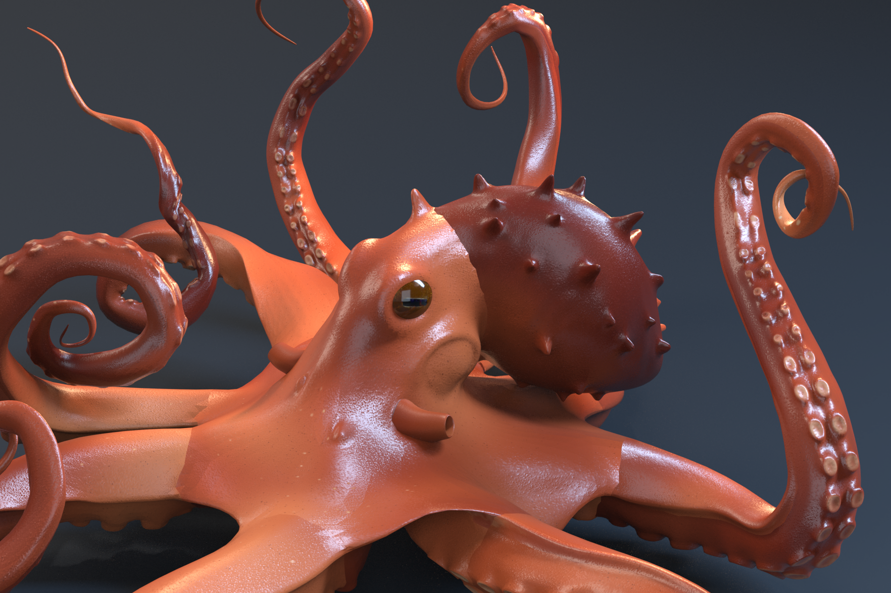
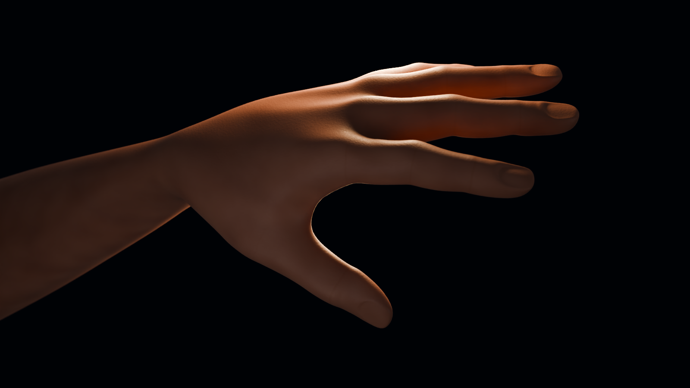
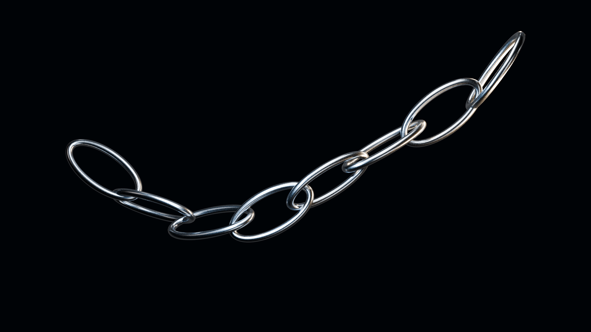
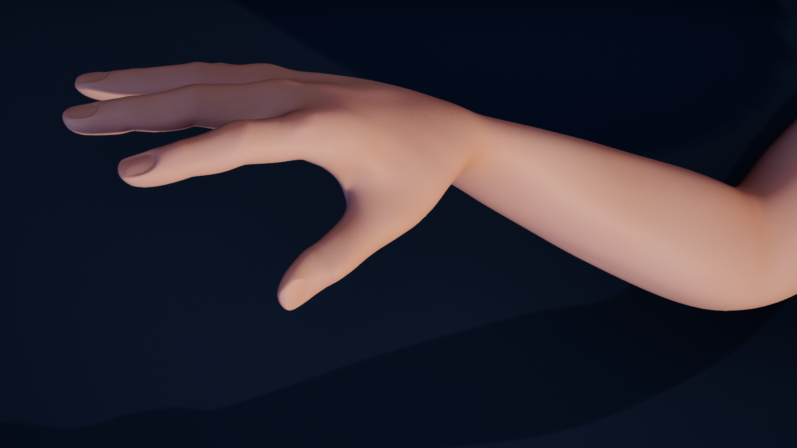
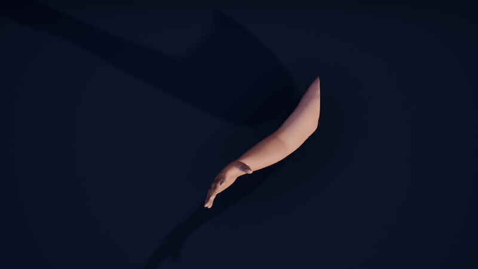
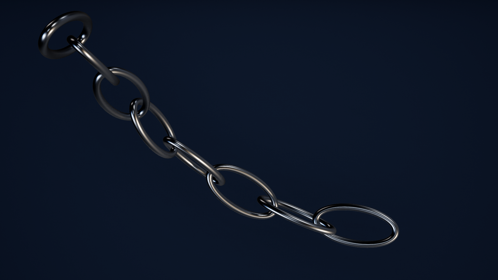
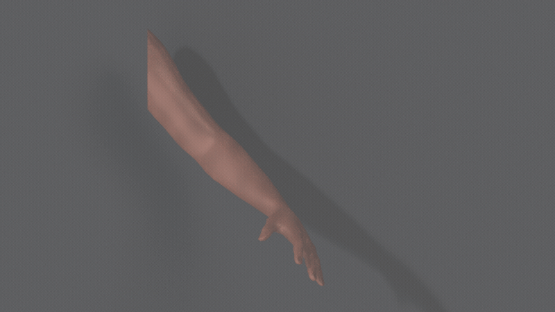
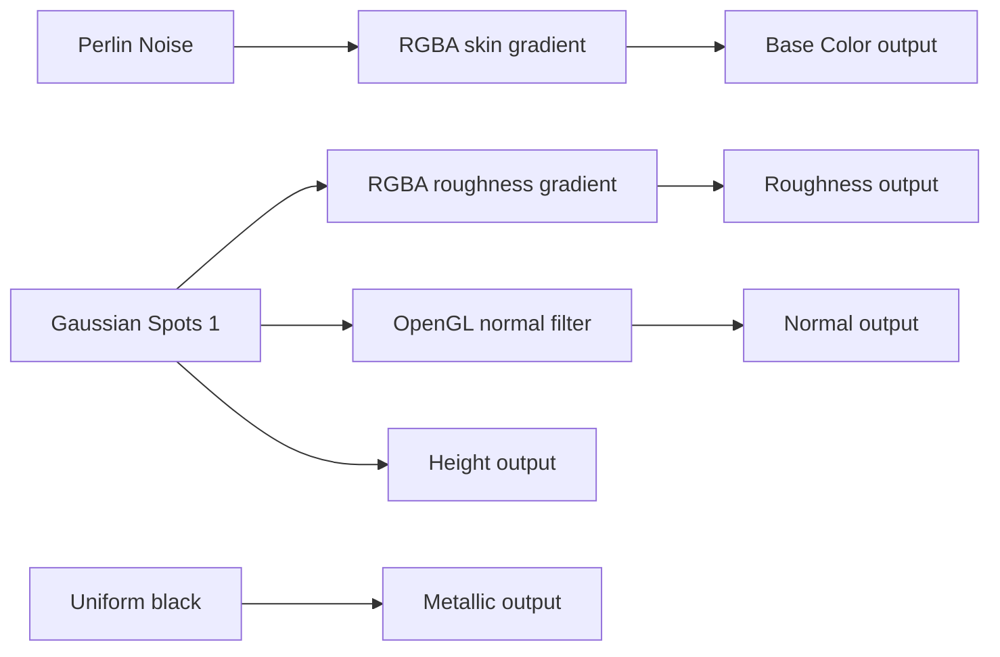
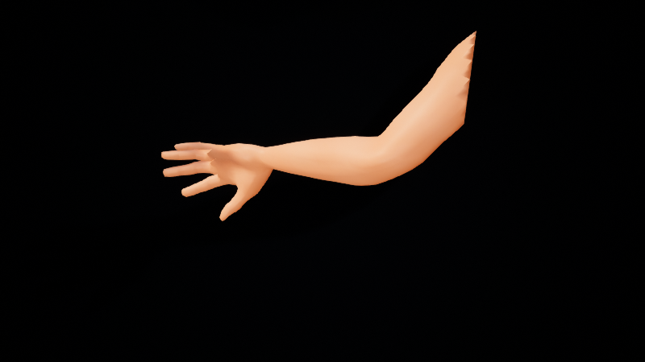
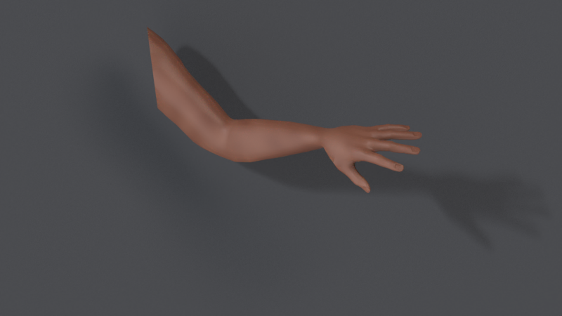

# Native deformation and render studies

Native Houdini Vellum arm response, fitted by Dem Bones and rendered with our
Designer material, a real HDRI and subsurface scattering. This stylized
**Kraken** sculpt has eight arms, modeled suckers, eyes and a mantle.

## Native softbody motion and Dem Bones reconstruction

[MP4 animation](octopus-mantra-motion.mp4) ·
[Native render and frame evidence](octopus-native-animation.json) ·
[Hero render evidence](octopus-native-hero.json)

The source is actual Vellum stretch, bend and internal struts, with 96 compliant
tip targets, inertia, self collision and ground contact. After warmup, 48
samples cover four seconds at 12 fps. All eight tips move approximately
27–39 cm peak to peak and lag their drivers by 83–167 ms. The 8,000-point
proxy has 60 boundary edges; this is not a closed pressure or volume benchmark.
The original first and last samples are retained, without forcing a seamless loop.

Dem Bones fits **81 rigid transforms and sparse weights**, with no more than
six influences per proxy vertex. Normalized RMSE is **0.04102%** of the rest
bounding-box diagonal. Tip excursions retain **96.46–100.22%** of source
motion; the largest tip reconstruction error is **17.42 mm**. Maximum proxy
ground penetration is **0.945 mm**. These residuals describe the numerical
proxy, separately from presentation smoothing and shader detail.

Native Point Deform transfers the reconstruction to the original **29,542
vertices / 58,912 triangles**, preserving all three UV sets. A fixed local
capture radius of 0.8% of the proxy diagonal and four to eight neighbors avoids
extrapolation between adjacent curls. All 48 artist surfaces pass the unchanged
2 mm contact limit; their maximum penetration is **0.259 mm**. The simulation
floor, fitted weights and transforms are preserved. A separate process reopens
the saved HIP and reproduces all source, proxy and artist buffers exactly.

[Physical source](octopus-softbody-native-source.json) ·
[Fit and acceptance](octopus-softbody-native-report.json) ·
[All-frame native readback](octopus-softbody-native-readback.json) ·
[Independent scene reopen](octopus-softbody-native-reopen.json)

The [scientific plate](octopus-scientific-evidence.json) uses the accepted
numerical cache, one camera and one linear residual range across all 48 frames.
Solid tip paths are source samples; dashed paths are native fitted evaluations.
No motion or residual is amplified. This Matplotlib visualization is separate
from the native Mantra beauty renders and high-resolution artist contact checks.

The 1800 × 1200 hero uses 6 × 6 pixel samples and a composition for frame 12.
The complete 960 × 640 animation uses 4 × 4 samples and a separate fixed camera
containing all 48 artist poses. Both use one Loop presentation subdivision level,
recomputed vertex normals and the unchanged Designer maps. The floor matches
the physical simulation. Native float EXRs are retained; official SideFX OIDN
creates color-only display copies, with its filtering and frame hashes recorded.
Display transfer approximates RGB gamma 2.2 and clips HDR values above one;
it is not ACES or a measurement of biological tissue. Per-image filtering does
not establish temporal consistency.

The earlier [33-control baseline](octopus-native-report.json) uses authored
curl and twist, with normalized RMSE 0.01813%. It is an easier kinematic
comparison, separate from the Vellum source and its contact acceptance.

## Octopus Designer surface and subsurface scattering

This 1800 × 1200 native Mantra detail frames the eye and modeled cup-shaped
suckers of **Kraken**, a static artist sculpt by
[FIELDFLY3R (current display name: fld)](https://sketchfab.com/FIELDFLY3R),
[CC BY 4.0](https://creativecommons.org/licenses/by/4.0/).
[Source and modifications](../../../examples/showcase/assets/octopus/SOURCE.json)
identify the original bytes, the complete octopus mesh and excluded decorations.
This rest-surface material study is separate from motion and solver acceptance.

The [new Designer material](https://github.com/loonghao/py-dem-bones/blob/8a7664d1c6e7dbe0f70a58258486274e15bda96b/examples/showcase/materials/octopus/README.md)
contains editable SBS, compiled SBSAR and 18 native 2K maps. Copper/coral mottles,
irregular freckles and fine pores cover the body; modeled suckers receive a
paler skin. The original eye texture and all three UV sets are retained. An
OpenGL tangent normal adds surface detail; the eye mask excludes SSS and supplies
the flatter, smoother eye response. Native cook and repeated render hashes match.

| Identical surface, camera and lighting: SSS off | SSS on: weight 0.48, distance 3 mm |
| --- | --- |
|  |  |

Both stills use an 85 mm lens, 6 × 6 pixel samples, one Loop presentation
subdivision level, freshly computed vertex normals, a real CC0 Poly Haven HDRI
and four softboxes. Only SSS weight changes; the surface position buffer and all
light parameters match. Approximately **43.3%** of displayed pixels change by
more than 0.01 in at least one RGB channel. These are artistic shader settings,
not measured tissue coefficients. No depth-of-field blur is added.

[Native material, render and processing evidence](octopus-material-render.json)
records original float EXR hashes, SideFX color-only OIDN copies and the disclosed
RGB gamma 2.2 display transfer. Original EXRs remain unchanged; HDR values above
one are clipped only in the display copy. This is not ACES or calibrated color
matching between renderers.

## Skin detail and subsurface scattering

Our own nine-influence skinning on a free CC0 arm is reconstructed from 48 mesh
poses and checked in Maya, Blender, Houdini and Unreal Engine 5.8. Its normalized
RMSE is approximately **0.067%**. Material and lighting studies retain those
accepted solver weights and poses.

The 1920 × 1080 Cycles closeup uses an 85 mm perspective camera, unchanged
Designer texture exports, a real Poly Haven HDRI and rectangular softboxes.
Rest-space shader detail adds complexion variation, fine pores, roughness and
knuckle creases. These details are artist-authored; the free mesh is not a
scan of biological tissue. Two presentation subdivision levels are excluded
from numerical acceptance.

| Identical backlight: SSS off | SSS on, weight 0.25 and scale 2 mm |
| --- | --- |
|  |  |

Both native 1600 × 900 renders use frame 12, the same camera, maps, lighting
and 256 samples. Only SSS weight changes. Approximately 42.5% of visible
pixels change by more than 0.01 in the displayed RGB channels. This is a
controlled artistic demonstration, not measured skin scattering coefficients.
The presentation uses 0.1 metres per fixture unit. Saved Blender scenes were
reopened; all 48 rig poses and packed texture/HDRI byte hashes matched.
[Native material, render and reopen evidence](premium-blender-evidence.json)
records the settings and unmodified output hashes.

## Steel reflections and rigid articulation

[1280 × 720 MP4, 48 native frames](premium-blender-chain.mp4) retains more
material detail than the GIF. Metallic steel, varied roughness, small surface
scuffs and long softbox reflections make the link curvature visible. An 85 mm
camera and softboxes track actual pose bounds; the rig, frame order and
12 fps timing are unchanged. One render subdivision level is presentation only.

Eight alternating links contain 2,560 numerical vertices and polygons. Each
source link has one rigid influence. Maximum relative Blender edge stretch is
`0.002655%`, below the `0.1%` contract limit. The other three hosts also pass.
This is prescribed articulation, not a collision or dynamics simulation.

## Show what the solver preserves

[Watch the 48-frame evidence video](premium-solver-evidence.mp4) ·
[Metrics, fixed scales and provenance](premium-solver-evidence.json)

The four views show authored source motion, the accepted Blender native
reconstruction, blended colors for nine solver weight slots, and actual
Euclidean vertex residuals. A single orthographic view and fixed error range
`0–0.485221%` of the rest bounding-box diagonal cover every frame. Geometry is
not displaced to amplify errors. This Matplotlib visualization uses original
vertex indices and cached native coordinates; it is separate from beauty
renders and fresh host acceptance.

The chain and tentacle are procedural fixtures inspired by
[SSDR](https://binh.graphics/papers/2012sa-ssdr/). They do not reproduce
measurements on the paper's original datasets.

## Unreal hand detail

[1280 × 720 MP4](premium-unreal-arm.mp4) ·
[Hero receipt](premium-unreal-arm-hero.json) ·
[48-frame native capture receipt](premium-unreal-arm-sequence.json)

Native HDRI, area lights, a lit graphite stage and Designer BaseColor,
Roughness and Normal exports drive the real-time legacy Subsurface material.
An independent GeometryScript Loop render proxy has 33,362 vertices; the
numerical mesh remains 2,087 vertices. Native weight and all-pose readback
match the accepted cache exactly before smoothing. The closeup frames the
hand and wrist. This is a case-owned DynamicMesh SDK preview, not a
SkeletalMesh/animation exporter or path-traced skin.
The saved arm and chain maps were reopened through the official editor API;
render-proxy geometry counts and native material references passed
[native readback](premium-unreal-reopen.json).

### Native steel chain

[48-frame GIF](premium-unreal-chain.gif) ·
[1280 × 720 MP4](premium-unreal-chain.mp4) ·
[Native capture receipt](premium-unreal-chain-sequence.json)

Metallic steel at roughness `0.28` uses the specified HDRI reflection capture
and native scene reflections. Its 2,560-vertex numerical mesh is checked
before the independent 40,960-vertex Loop render proxy is built. The original
eight rigid links and all 48 accepted poses remain unchanged.

## Four-host deformation gallery

| Blender 5.2 — Cycles source / reconstructed | Maya 2026 — Arnold first pass |
| --- | --- |
|  |  |

| Houdini 22.0 — Mantra HDRI + SSS | Unreal 5.8 — first HDRI/Subsurface preview |
| --- | --- |
|  |  |

These complete GIFs contain 48 native frames at 800 × 450 and approximately
four seconds at 12 fps. The Houdini display copy uses SideFX's official
color-only OIDN denoiser followed by an approximate gamma 2.2 transfer in
full-range RGB; original linear EXRs remain intact. Other native pixels are
encoded into GIF/MP4 display copies. No generated imagery, interpolated
poses or geometry correction is used. Renderer transforms and preview scales
differ; this is not a calibrated cross-renderer skin comparison.

[Houdini OpenGL tentacle deformation](houdini-tentacle.gif) ·
[Original Cycles SSS pair](sss-on.png) ·
[Original packed material readback](blender-packed-readback.json)

Maya retains its first Designer palette and SSS scale `0.09`; its updated
look development has not passed native acceptance. Public native scene
delivery and full Designer graph capture remain separate pending items.
See [validation](validation.json) and [published file hashes](manifest.json).

## Source mesh and our own skin weights

[MakeHuman core graphical assets are CC0](https://static.makehumancommunity.org/about/license.html).
The source is pinned to commit `a8bc2d54ff0ac92e78ff71431b1023eda42bf482`.
We clip the body to an arm, weld boundary intersections and close the shoulder.
The original rig, skin weights and skin textures are excluded.
[Provenance and hashes](../../../examples/showcase/assets/SOURCE.json) record
the exact source and modifications.

Our weight authoring uses shoulder, elbow, wrist, palm and five finger bases.
An anatomical capsule falloff keeps at most four influences per vertex,
then normalizes their sum. This is scripted weight authoring rather than a
claim of interactive brush painting. Maya's source skinCluster is written,
read back and sampled for every pose. Blender independently evaluates a
native source rig for the side-by-side presentation.

The solver receives ordered mesh poses and polygon connectivity. A hard
nearest-center seed initializes nine regions; source joint transforms are
not supplied to the solver. The animation is an approximation of those
authored poses, rather than a scan of biological tissue or a captured actor.

## Numerical validation

| Host | Native evaluation | Arm normalized RMSE |
| --- | --- | ---: |
| Maya 2026 | skinCluster and keyed solved joints | 0.0672013% |
| Blender 5.2.0 LTS | armature and evaluated mesh | 0.0672015% |
| Houdini 22.0.368 | scalar weights and case-owned Python SOP LBS | 0.0672012% |
| Unreal 5.8.0 | DynamicMesh bone profile and case-owned SDK LBS | 0.0670133% |

Normalized RMSE is the root mean square Euclidean vertex error divided by the
rest mesh bounding-box diagonal. Every host verifies all 48 frames, finite
nonnegative weights, normalized weight sums, rigid rotations, and native
evaluation against the solved linear blend skinning result. The cached
native arrays were revalidated on 2026-09-30; this is separate from a fresh
live-host run. The UE difference includes native bone-weight quantization.

Houdini uses the package's scalar weight attributes plus an explicit example
deformer, not a production boneCapture rig. Unreal uses a version-owned
DynamicMesh bridge, not a SkeletalMesh or animation asset exporter.
Render-only smoothing in all new studies is excluded from numerical checks.

MakeHuman uses [decimeters internally](https://static.makehumancommunity.org/makehuman/docs/exports_and_file_formats.html).
Maya, Blender and Houdini retain the asset's numeric coordinates in this case.
The current Unreal preview multiplies samples by `100`, so it is ten times
the physical arm size in centimeters. Raw distance errors and scattering
scales are therefore not physically comparable across hosts. The normalized
metric remains independent of a uniform preview scale.

## Material authored in Substance 3D Designer

[Editable SBS](../../../examples/showcase/materials/skin/material.sbs) ·
[Native SBSAR export](../../../examples/showcase/materials/skin/material.sbsar) ·
[First preview palette](../../../examples/showcase/materials/skin/preview-v1/BaseColor.png)

Designer 16.0.0's native graph uses Perlin Noise for broad color variation
and Gaussian Spots 1 for pores. RGBA gradient keys establish the skin palette
and roughness; pores feed Height and an OpenGL normal filter at intensity
`0.025`. Metallic is zero. The native DCC-MCP export job completed and the
SBSAR archive passes its container integrity check. The saved SBS was closed,
reopened and recomputed through the official SDK at explicit 1024² resolution.
All five source exports match the published bytes;
[native readback](designer-native-readback.json) records the evidence.
The SBSAR was also loaded and instantiated in a fresh native graph. All five
connected outputs have matching byte hashes and verified PNG dimensions/depth.

This diagram reflects the saved graph connections. A complete unretouched
DCC-CUA graph capture is still pending. The SBS references the installed
Adobe standard library using `sbs://`; library source files are not included.

| Exported map | Resolution | Native PNG | Interpretation |
| --- | --- | --- | --- |
| [Base Color](../../../examples/showcase/materials/skin/BaseColor.png) | 1024² | RGBA16 | sRGB |
| [Roughness](../../../examples/showcase/materials/skin/Roughness.png) | 1024² | RGBA16 | linear data |
| [Metallic](../../../examples/showcase/materials/skin/Metallic.png) | 1024² | RGB8 | linear data |
| [Height](../../../examples/showcase/materials/skin/Height.png) | 1024² | Gray16 | linear data |
| [Normal](../../../examples/showcase/materials/skin/Normal.png) | 1024² | RGBA16 | linear data, OpenGL +Y |

Check [validation.json](validation.json) for native header values. The Normal
map is bound in the new Unreal study after native tangent/UV setup. The
original previews do not bind it; Cycles instead uses rest-space micro-bump.

## HDRI, SSS and renderer differences

The native equirectangular HDRI is
[Poly Haven Studio Small 09](https://polyhaven.com/a/studio_small_09),
[CC0](https://polyhaven.com/license). Its unchanged 2K Radiance file and
[publisher digest](../../../examples/showcase/assets/lighting/SOURCE.json)
are included. Blender uses an Environment Texture, Maya an Arnold sky dome
with a Raw file texture, Houdini an environment light, and Unreal a native
TextureCube on a SkyLight. Host-specific area/directional lights supplement
the Blender, Maya and Unreal previews.

| Renderer | Bound SD maps | Mapping / SSS |
| --- | --- | --- |
| Cycles | Base Color, Roughness, Height | rest-space box mapping ×3; Principled SSS weight 0.65; radius (1, 0.35, 0.18) |
| Arnold | Base Color, Roughness, Height | Maya automatic UV projection ×3; standardSurface SSS weight 0.65; radius (1, 0.35, 0.2) |
| Mantra | Base Color | rest-space planar UVs ×3; Principled SSS weight 0.65; roughness scalar 0.55 |
| Unreal | Base Color, Roughness | native planar UV projection; legacy Subsurface model, opacity 0.45 |

The completed Cycles clip uses scatter scale `0.03`; Arnold retains `0.09`.
These are artistic scene settings, not
measured skin coefficients. Cycles uses denoising and 64 animation samples;
Arnold uses AA 3 and diffuse samples 2 with color-managed PNG output. The
Mantra animation uses 6 × 6 pixel samples; its frame-12 still uses 12 × 12.
Its linear EXR is displayed
with official color-only OIDN denoising and a full-range RGB gamma 2.2
transfer. Black is preserved. HDR values above one are clipped before the
8-bit display transfer; native EXRs remain intact. This is not ACES or an
identical cross-renderer color transform. Unreal uses HDRI intensity `0.5`, half the example's
directional light intensities and manual exposure bias `1.0`. Its native
`ImageWriteBlueprintLibrary` exports all 48 PNGs synchronously, with valid
chunk CRCs and no trailing bytes; source images are preserved unchanged.

The background Mantra job verified all 48 new EXR files with zero warnings.
The earlier interrupted sequence is excluded. Blender's relative packed
textures have passed native scene reopen
and byte readback. Public native scene delivery, UV/tangent review and the
updated Maya sequence still require acceptance.

## Reproduce and resume

Follow the [DCC-MCP example guide](https://github.com/loonghao/py-dem-bones/tree/main/examples/showcase).
Use a disposable scene/project, a wheel matching the host's Python ABI, and
an exactly selected live DCC-MCP instance. Application UI uses the project
DCC-CUA route only when the official application API cannot express the
operation. When an official API exists but DCC-MCP lacks a tool, implement
and validate the typed adapter capability first. Maya and Houdini startup
integration repairs are tracked in the owning adapters. Official Hython
headless rendering is available; its [48-pose SOP readback](houdini-native-readback.json)
matches the accepted geometry cache exactly. The updated native scene is saved.
